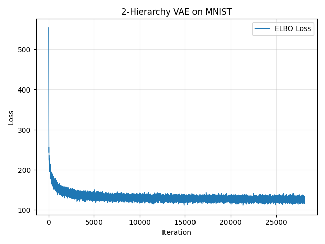
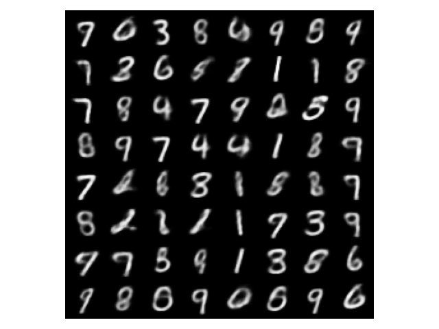
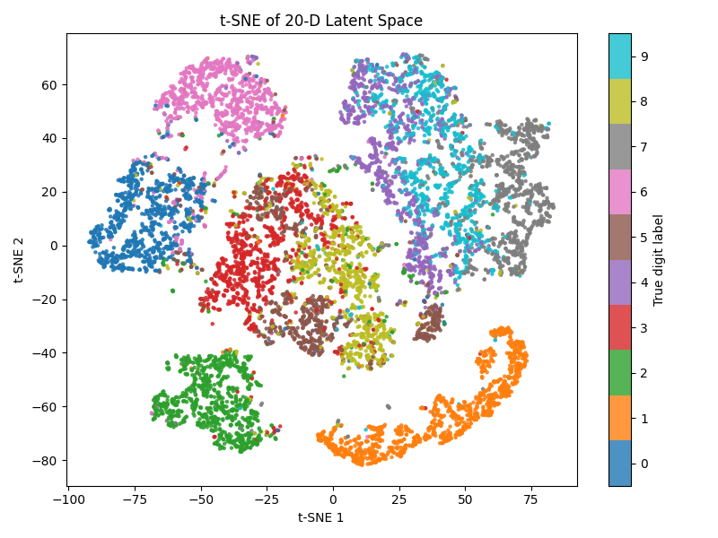
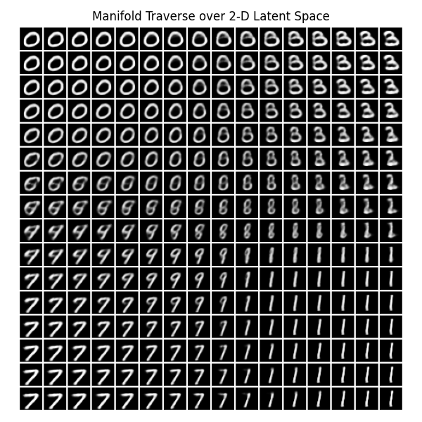

# Hierarchical VAE

[🔗Velog - [DL] 계층형 VAE의 일반화](https://velog.io/@lumerico284/DL-%EA%B3%84%EC%B8%B5%ED%98%95-VAE%EC%9D%98-%EC%9D%BC%EB%B0%98%ED%99%94%EC%99%80-%EA%B5%AC%ED%98%84)

## 구현

PyTorch를 이용해 **2-계층 VAE**를 구현함.

### 🔷 인코더 모듈

```py
class Encoder(nn.Module):
    def __init__(self, in_dim: int, hidden_dim: int, latent_dim: int) -> None:
        super().__init__()
        self.linear = nn.Linear(in_dim, hidden_dim)
        self.linear_mu = nn.Linear(hidden_dim, latent_dim)
        self.linear_logvar = nn.Linear(hidden_dim, latent_dim)

    def forward(self, x: torch.Tensor) -> tuple[torch.Tensor, torch.Tensor]:
        h = F.relu(self.linear(x))
        mu = self.linear_mu(h)
        logvar = self.linear_logvar(h)

        sigma = torch.exp(0.5 * logvar)
        return mu, sigma
```


### 🔶 디코더 모듈

```py
class Decoder(nn.Module):
    def __init__(
        self,
        latent_dim: int,
        hidden_dim: int,
        out_dim: int,
        use_sigmoid: bool = False,
    ) -> None:
        super().__init__()
        self.linear_1 = nn.Linear(latent_dim, hidden_dim)
        self.linear_2 = nn.Linear(hidden_dim, out_dim)
        self.use_sigmoid = use_sigmoid

    def forward(self, z: torch.Tensor) -> torch.Tensor:
        h = F.relu(self.linear_1(z))
        h = self.linear_2(h)
        return torch.sigmoid(h) if self.use_sigmoid else h
```

### 🎲 재매개변수화 트릭 함수

```py
def reparameterize(mu: torch.Tensor, sigma: torch.Tensor) -> torch.Tensor:
    eps = torch.randn_like(sigma)
    return mu + eps * sigma
```

### ⭐ 계층형 VAE 클래스

```py
class HierarchicalVAE(nn.Module):
    def __init__(
        self,
        input_dim: int,
        hidden_dim: int,
        latent_dim: int,
        num_layers: int = 2,
        use_bce: bool = True,
    ) -> None:
        super().__init__()
        assert num_layers >= 1, "Number of layers must be >= 1"
        self.num_layers = num_layers
        self.use_bce = use_bce

        # Build encoders and decoders dynamically
        dims = [input_dim] + [latent_dim] * (num_layers - 1)
        self.encoders = nn.ModuleList(
            [Encoder(dims[i], hidden_dim, latent_dim) for i in range(num_layers)]
        )
        self.decoders = nn.ModuleList()
        for i in range(num_layers):
            if i == 0:
                # decoder for z1 -> x
                self.decoders.append(
                    Decoder(latent_dim, hidden_dim, input_dim, use_sigmoid=True)
                )
            else:
                # decoder for z_{i+1} -> z_i
                self.decoders.append(Decoder(latent_dim, hidden_dim, latent_dim))

    def get_loss(self, x: torch.Tensor) -> torch.Tensor:
        batch_size = x.size(0)

        # Encoding pass
        mus, sigmas, zs = [], [], []
        h = x
        for enc in self.encoders:
            mu, sigma = enc(h)
            z = reparameterize(mu, sigma)
            mus.append(mu)
            sigmas.append(sigma)
            zs.append(z)
            h = z

        # Decoding pass
        x_hat = self.decoders[0](zs[0])
        z_hats = [None] * (self.num_layers - 1)
        for level in range(self.num_layers, 1, -1):
            idx = level - 1
            z_hats[idx - 1] = self.decoders[idx](zs[idx])

        # Reconstruction loss
        if self.use_bce:
            L_recon = F.binary_cross_entropy(x_hat, x, reduction="sum")
        else:
            L_recon = F.mse_loss(x_hat, x, reduction="sum")

        # KL divergence
        # Top-level prior N(0,I)
        mu_T, sigma_T = mus[-1], sigmas[-1]
        L_kl = -torch.sum(1 + torch.log(sigma_T.pow(2)) - mu_T.pow(2) - sigma_T.pow(2))

        # Intermediate levels prior N(z_hat, I)
        for i in range(self.num_layers - 1):
            mu_i, sigma_i = mus[i], sigmas[i]
            z_hat_i = z_hats[i]
            L_kl += -torch.sum(
                1 + torch.log(sigma_i.pow(2)) - (mu_i - z_hat_i).pow(2) - sigma_i.pow(2)
            )

        return (L_recon + L_kl) / batch_size
```

> 💡 손실함수의 종류를 두가지(BCE, MSE)로 세분화하였음. (`use_bce=True`이면 BCE 사용)

## 훈련 & 평가

### 🌐 훈련 환경

```py
input_dim = 784
hidden_dim = 100
latent_dim = 20
num_layers = 2

epochs = 30
learning_rate = 1e-3
batch_size = 64

optimizer = optim.Adam(...)
```

> 총 파라미터 수: *174,084*

### 📃 훈련 결과

#### 1️⃣ 훈련 손실함수 그래프

<p align="center">
 
</p>

#### 2️⃣ 랜덤 숫자 이미지 생성

표준정규분포 $\mathcal{N}(\mathbf{x};\mathbf{0},\mathbf{I})$ 에서 표본 64개를 추출, 학습된 계층형 VAE에 입력함.

<p align="center">
 
</p>

#### 3️⃣ 잠재공간 t-SNE 시각화

마지막 잠재변수의 분포 $q_{\phi_2}(z_2|z_1)$를 t-SNE를 통해 2차원으로 낮춰 시각화함.

<p align="center">
 
</p>

#### 4️⃣ 잠재공간에서 학습된 다양체(Manifold) 투영

잠재공간의 첫번째 차원과 두번째 차원을 $\mathbb{R}\in[-3,3]$ 범위에서 탐색하여 고차원 잠재공간 내에서 학습된 다양체를 2차원으로 투영함.

<p align="center">
 
</p>
